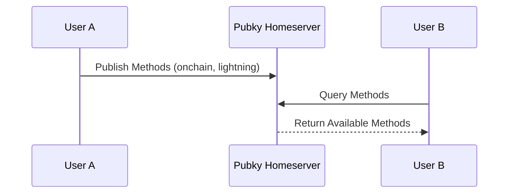
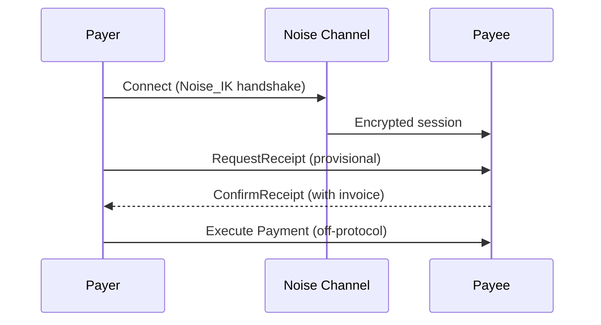

# Paykit

> **A flexible, decentralized payment protocol built on Pubky for discovering and coordinating payments across multiple methods (Bitcoin onchain, Lightning, and more).**

Paykit enables seamless payment discovery, negotiation, and coordination through public directories and private encrypted channels. It provides a unified interface for managing payments across different methods while maintaining privacy and cryptographic security.

## Table of Contents

- [Key Features](#key-features)
- [Quick Start](#quick-start)
- [Project Structure](#project-structure)
- [Architecture](#architecture)
- [Components](#components)
- [Installation](#installation)
- [Testing](#testing)
- [Documentation](#documentation)
- [Security](#security-considerations)
- [Contributing](#contributing)

---

## Key Features

### Core Capabilities

- **Payment Method Discovery**: Query public directories to discover how someone accepts payments
- **Public Directory Publishing**: Publish your payment methods to Pubky homeservers for discovery
- **Encrypted Payment Channels**: Private Noise Protocol channels for secure payment negotiation
- **Receipt Exchange**: Cryptographic proof of payment coordination and tracking
- **Multi-Method Support**: Bitcoin onchain, Lightning Network, and extensible to other methods
- **Contact Management**: Store and manage payment counterparties with metadata
- **Health Monitoring**: Real-time status checks for payment methods
- **Smart Method Selection**: Strategy-based selection (cost, speed, privacy, balanced)

### Subscription & Automation

- **Subscription Management**: Create and manage recurring payment agreements
- **Auto-Pay Rules**: Automated payment approval with configurable conditions
- **Spending Limits**: Per-peer and global limits with daily/weekly/monthly periods
- **Payment Requests**: Create, send, and manage payment requests with expiration
- **Cryptographic Signatures**: Secure subscription agreements with Ed25519 signatures

### Platform Support

- **CLI**: Full-featured command-line interface with real payment execution
- **Web**: WebAssembly browser application with interactive dashboard
- **iOS**: Native SwiftUI app with Keychain storage and FFI integration
- **Android**: Native Jetpack Compose app with EncryptedSharedPreferences and FFI integration

## Project Structure

```
paykit-rs/
├── paykit-lib/              # Core library (directory, transport traits, executors)
├── paykit-interactive/      # Interactive payment protocol (Noise + receipts)
├── paykit-subscriptions/    # Subscription management and auto-pay
├── paykit-demo-core/        # Shared demo application logic
├── paykit-demo-cli/         # Command-line demo application
├── paykit-demo-web/         # WebAssembly browser demo application
└── paykit-mobile/           # Mobile FFI bindings and demo apps
    ├── src/                 # UniFFI bindings (Rust)
    ├── swift/               # iOS Keychain storage adapter
    ├── kotlin/              # Android EncryptedSharedPreferences adapter
    ├── ios-demo/            # Complete iOS demo app (SwiftUI)
    └── android-demo/        # Complete Android demo app (Jetpack Compose)
```

## Quick Start

### Try the CLI Demo

The fastest way to experience Paykit:

```bash
cd paykit-demo-cli
cargo build --release

# Create an identity
./target/release/paykit-demo setup --name alice

# View your Pubky URI
./target/release/paykit-demo whoami

# Discover someone's payment methods
./target/release/paykit-demo discover pubky://8pinxxgqs41n4aididenw5apqp1urfmzdztr8jt4abrkdn435ewo

# Create a subscription
./target/release/paykit-demo subscriptions create --provider pubky://... --amount 10000 --frequency monthly

# Configure auto-pay
./target/release/paykit-demo autopay enable --peer pubky://... --max-amount 50000
```

See the [CLI README](paykit-demo-cli/README.md) for complete documentation.

### Try the Web Demo

Run the WebAssembly demo in your browser:

```bash
cd paykit-demo-web
wasm-pack build --target web --out-dir www/pkg
cd www
python3 -m http.server 8080
```

Then open `http://localhost:8080` in your browser. See the [Web Demo README](paykit-demo-web/README.md) for complete documentation.

### Try the Mobile Demos

**iOS**: Open `paykit-mobile/ios-demo/PaykitDemo/PaykitDemo.xcodeproj` in Xcode  
**Android**: Open `paykit-mobile/android-demo` in Android Studio

See the [Mobile README](paykit-mobile/README.md) for complete setup instructions.

## Complete Feature List

### Identity & Key Management

- ✅ Ed25519 identity keypairs (pkarr-compatible)
- ✅ X25519 device keys for Noise protocol (HKDF derivation)
- ✅ Multiple identity support with switching
- ✅ Encrypted key backup/restore (Argon2 + AES-GCM)
- ✅ Platform-native secure storage:
  - iOS: Keychain Services
  - Android: EncryptedSharedPreferences with hardware-backed keystore
  - Web: localStorage (demo) / IndexedDB (production-ready)
  - CLI: Encrypted file storage

### Directory Operations

- ✅ **Publish Payment Methods**: Make your payment endpoints discoverable
- ✅ **Discover Methods**: Query public directories for payment methods
- ✅ **Fetch Endpoints**: Get specific payment endpoints by method
- ✅ **Remove Endpoints**: Unpublish payment methods
- ✅ **Fetch Known Contacts**: Discover contacts from Pubky follows
- ✅ **Multiple Publishing Modes** (Web):
  - Mock mode (localStorage only)
  - Direct mode (CORS-enabled homeserver)
  - Proxy mode (via CORS proxy)

### Payment Methods

- ✅ **Method Listing**: Discover available payment methods
- ✅ **Health Monitoring**: Real-time status checks for each method
- ✅ **Endpoint Validation**: Verify addresses/invoices before use
- ✅ **Smart Selection**: Strategy-based method selection:
  - Balanced (default)
  - Cost-optimized
  - Speed-optimized
  - Privacy-focused
- ✅ **Usability Checks**: Verify method availability before payment

### Payment Coordination

- ✅ **Noise Protocol Channels**: Encrypted TCP/WebSocket channels
- ✅ **Payment Requests**: Create and manage payment requests
- ✅ **Receipt Exchange**: Cryptographic proof of payment coordination
- ✅ **Request/Response Flow**: Negotiate payment terms securely
- ✅ **Private Endpoint Exchange**: Share endpoints over encrypted channels

### Subscriptions

- ✅ **Create Subscriptions**: Set up recurring payment agreements
- ✅ **Multiple Frequencies**: Daily, weekly, monthly, yearly billing
- ✅ **Proration Calculator**: Calculate charges for upgrades/downgrades
- ✅ **Active/Paused States**: Manage subscription lifecycle
- ✅ **Cryptographic Signatures**: Secure subscription agreements
- ✅ **Payment Request Generation**: Auto-generate requests from subscriptions

### Auto-Pay & Spending Limits

- ✅ **Global Auto-Pay Toggle**: Enable/disable auto-pay system-wide
- ✅ **Global Daily Limits**: Set spending caps per day
- ✅ **Per-Peer Limits**: Individual limits with usage tracking
- ✅ **Auto-Pay Rules**: Custom conditions for automatic approval
- ✅ **Period Tracking**: Daily/weekly/monthly period management
- ✅ **Atomic Reservations**: Thread-safe spending reservations
- ✅ **Overflow Protection**: Safe arithmetic with bounds checking

### Receipts & Payment History

- ✅ **Receipt Generation**: Create receipts via FFI with cryptographic IDs
- ✅ **Receipt Storage**: Persistent storage with search and filtering
- ✅ **Status Tracking**: Pending, completed, failed, refunded
- ✅ **Transaction IDs**: Link receipts to on-chain transactions
- ✅ **Counterparty Tracking**: Track payments by contact
- ✅ **Memo Support**: Add notes to receipts
- ✅ **Statistics**: Total sent/received, completion rates

### Contacts

- ✅ **Contact Management**: Add, edit, delete contacts
- ✅ **Search & Filter**: Find contacts by name or public key
- ✅ **Payment History**: Track payments per contact
- ✅ **Metadata**: Notes and custom fields
- ✅ **Import from Pubky**: Import contacts from follows directory

### Dashboard & Analytics

- ✅ **Unified Dashboard**: Overview of all Paykit features
- ✅ **Real-Time Statistics**: Contacts, methods, receipts, subscriptions
- ✅ **Recent Activity**: Latest receipts and requests
- ✅ **Quick Actions**: Common tasks accessible from dashboard
- ✅ **Progress Tracking**: Setup completion indicators

## Demo Applications

### CLI Demo (`paykit-demo-cli`)

**Status**: ✅ **Reference Implementation** - Most complete demo with all features

**Features**:
- Full identity and key management
- Real Pubky homeserver integration
- TCP-based Noise protocol channels
- Real payment execution (with LND/Esplora)
- Complete subscription lifecycle
- Auto-pay with spending limits
- Contact management
- Receipt tracking

**Use Cases**: Development, testing, server-side integration, reference implementation

### Web Demo (`paykit-demo-web`)

**Status**: ✅ **Full Feature Coverage** - Complete browser-based demo

**Features**:
- WebAssembly-based (runs entirely in browser)
- Interactive dashboard with statistics
- WebSocket-based Noise protocol
- Configurable directory publishing (Mock/Direct/Proxy)
- Full subscription and auto-pay management
- Contact management with localStorage
- Receipt history with filtering
- Payment method configuration

**Use Cases**: Browser-based applications, web wallets, demo/showcase

### iOS Demo (`paykit-mobile/ios-demo`)

**Status**: ✅ **Full FFI Integration** - Native SwiftUI app

**Features**:
- Keychain-backed secure storage
- Full FFI integration (Payment Methods, Health, Selection)
- Payment request persistence with FFI
- Receipt generation via FFI
- Configurable directory transport (mock/callback)
- Subscription management
- Auto-pay rules and spending limits
- Contact management
- Dashboard with statistics

**Use Cases**: iOS apps, mobile wallets, native integrations

### Android Demo (`paykit-mobile/android-demo`)

**Status**: ✅ **Full FFI Integration** - Native Jetpack Compose app

**Features**:
- EncryptedSharedPreferences with hardware-backed keystore
- Full FFI integration (Payment Methods, Health, Selection)
- Payment request persistence with FFI
- Receipt generation via FFI
- Configurable directory transport (mock/callback)
- Subscription management
- Auto-pay rules and spending limits
- Contact management
- Material 3 design
- Dashboard with statistics

**Use Cases**: Android apps, mobile wallets, native integrations

## Architecture

See [docs/ARCHITECTURE.md](docs/ARCHITECTURE.md) for complete architecture documentation with interactive Mermaid diagrams.

### Payment Discovery Flow



### Interactive Payment Flow



## Components

### paykit-lib

**Core library** providing payment method directory operations and transport abstractions.

**Key Features**:
- Transport trait abstractions (`AuthenticatedTransport`, `UnauthenticatedTransportRead`)
- Pubky homeserver integration
- Payment method discovery and publishing
- Health monitoring and method selection
- Payment executors (LND, Esplora, testnet)

**Key APIs**:
```rust
use paykit_lib::{
    AuthenticatedTransport,
    UnauthenticatedTransportRead,
    PubkyAuthenticatedTransport,
    PubkyUnauthenticatedTransport,
    MethodId,
    EndpointData,
};

// Publish payment methods
let transport = PubkyAuthenticatedTransport::new(session);
transport.upsert_payment_endpoint(&method_id, &endpoint_data).await?;

// Query payment methods
let transport = PubkyUnauthenticatedTransport::new(storage);
let methods = transport.fetch_supported_payments(&public_key).await?;
```

See [paykit-lib README](paykit-lib/README.md) for complete API documentation.

### paykit-interactive

**Interactive payment protocol** using Noise encryption and receipt exchange.

**Key Features**:
- Pubky Noise for encrypted channels (TCP, WebSocket)
- Receipt negotiation and exchange
- Private endpoint exchange
- Payment coordination messages
- Rate limiting and connection management

**Key APIs**:
```rust
use paykit_interactive::{
    PaykitInteractiveManager,
    PaykitNoiseChannel,
    PaykitReceipt,
};

// Initiate payment
let manager = PaykitInteractiveManager::new(storage, receipt_generator);
let receipt = manager.initiate_payment(&mut channel, provisional_receipt).await?;

// Handle payment request
let response = manager.handle_message(msg, &payer, &payee).await?;
```

See [paykit-interactive README](paykit-interactive/README.md) for complete documentation.

### paykit-subscriptions

**Subscription management and automated payments** with cryptographic security.

**Key Features**:
- Subscription agreements with Ed25519 signatures
- Payment requests with expiration and metadata
- Auto-pay rules with spending limits
- Thread-safe nonce tracking
- Safe arithmetic with overflow protection
- Per-peer and global spending limits

**Key APIs**:
```rust
use paykit_subscriptions::{
    Subscription, 
    SubscriptionTerms, 
    PaymentFrequency, 
    AutoPayRule
};

// Create subscription
let terms = SubscriptionTerms::new(
    amount, 
    currency, 
    PaymentFrequency::Monthly { day_of_month: 1 }
);
let subscription = Subscription::new(provider_pk, subscriber_pk, terms);

// Configure auto-pay
let rule = AutoPayRule::new(
    subscription_id, 
    peer_pk, 
    max_amount, 
    period_seconds
);
```

See [paykit-subscriptions README](paykit-subscriptions/README.md) for complete documentation.

### paykit-mobile

**Mobile FFI bindings** for iOS and Android with platform-native secure storage.

**Key Features**:
- UniFFI-based bindings (Swift, Kotlin)
- Platform-native secure storage adapters
- Complete demo apps with all Paykit features
- FFI integration for all core operations

**iOS Demo (SwiftUI)**:
- Keychain-based secure storage
- Full FFI integration
- Payment requests and receipts
- Subscription and auto-pay management

**Android Demo (Jetpack Compose)**:
- EncryptedSharedPreferences with hardware-backed keystore
- Material 3 design
- Full FFI integration
- Payment requests and receipts
- Subscription and auto-pay management

See [paykit-mobile README](paykit-mobile/README.md) and [Mobile Integration Guide](docs/mobile-integration.md) for complete documentation.

## Installation

### Prerequisites

- Rust 1.70+ (2021 edition)
- Cargo

### Build All Components

```bash
git clone <repo-url>
cd paykit-rs
cargo build --release
```

### Build Individual Components

```bash
# Core library
cd paykit-lib
cargo build

# Interactive protocol
cd paykit-interactive
cargo build

# Subscriptions
cd paykit-subscriptions
cargo build

# CLI demo
cd paykit-demo-cli
cargo build --release

# Web demo (WASM)
cd paykit-demo-web
wasm-pack build --target web --out-dir www/pkg

# Mobile bindings
cd paykit-mobile
cargo build --release
```

## Usage Examples

### Using paykit-lib

```rust
use paykit_lib::{MethodId, EndpointData, PubkyUnauthenticatedTransport};
use pubky::PublicStorage;

#[tokio::main]
async fn main() -> anyhow::Result<()> {
    // Create transport
    let storage = PublicStorage::new()?;
    let transport = PubkyUnauthenticatedTransport::new(storage);
    
    // Query payment methods
    let public_key = "8pinxxgqs41n4aididenw5apqp1urfmzdztr8jt4abrkdn435ewo".parse()?;
    let methods = transport.fetch_supported_payments(&public_key).await?;
    
    for (method_id, endpoint) in methods.entries {
        println!("{}: {}", method_id.0, endpoint.0);
    }
    
    Ok(())
}
```

### Using the CLI

```bash
# Setup identity
paykit-demo setup --name alice

# Add contact
paykit-demo contacts add bob pubky://...

# Discover payment methods
paykit-demo discover pubky://...

# Create subscription
paykit-demo subscriptions create --provider pubky://... --amount 10000 --frequency monthly

# Configure auto-pay
paykit-demo autopay enable --peer pubky://... --max-amount 50000

# View receipts
paykit-demo receipts
```

See [CLI README](paykit-demo-cli/README.md) for complete examples.

## Development Status

### Completed Features

**Core Components**
- ✅ `paykit-lib`: Core library with transport traits and public directory operations
- ✅ `paykit-interactive`: Interactive payment protocol with Noise encryption and receipts
- ✅ `paykit-subscriptions`: Subscription management, payment requests, and auto-pay automation
- ✅ `paykit-demo-core`: Shared business logic with SubscriptionCoordinator for demo applications
- ✅ `paykit-mobile`: Complete FFI bindings with platform-native storage adapters

**Demo Applications**
- ✅ `paykit-demo-cli`: Full-featured command-line demo with real payment execution
- ✅ `paykit-demo-web`: Complete WebAssembly browser demo with interactive UI
- ✅ `paykit-mobile/ios-demo`: iOS demo app with SwiftUI and Keychain storage
- ✅ `paykit-mobile/android-demo`: Android demo app with Jetpack Compose and EncryptedSharedPreferences

**Feature Parity**
- ✅ All demos have rich feature parity with real implementations
- ✅ Full FFI integration across iOS and Android
- ✅ Configurable directory publishing (Mock/Direct/Proxy)
- ✅ Persistent storage for all data types
- ✅ Comprehensive test coverage (100+ tests)

**Payment Plugins**
- ✅ `OnchainPlugin`: Bitcoin on-chain payment execution with proof generation
- ✅ `LightningPlugin`: Lightning Network payments (BOLT11, LNURL)

### In Progress

- Full Noise protocol integration for live payments
- Pubky session creation API improvements
- Real-time payment negotiation enhancements

### Planned

- Desktop Electron app (end-user application)
- Multi-signature support
- Hardware wallet integration
- Additional payment method plugins

## Testing

```bash
# Run all tests
cargo test --all --all-features

# Test specific component
cd paykit-lib && cargo test
cd paykit-interactive && cargo test
cd paykit-subscriptions && cargo test

# Test with network access (for integration tests)
cargo test --test pubky_sdk_compliance -- --test-threads=1

# Test mobile FFI bindings
cd paykit-mobile && cargo test --lib
```

## Documentation

### Component Documentation
- [paykit-lib](paykit-lib/README.md) - Core library API reference
- [paykit-interactive](paykit-interactive/README.md) - Interactive payment protocol
- [paykit-subscriptions](paykit-subscriptions/README.md) - Subscription management
- [paykit-demo-core](paykit-demo-core/README.md) - Shared demo logic
- [paykit-demo-cli](paykit-demo-cli/README.md) - CLI demo user guide
- [paykit-demo-web](paykit-demo-web/README.md) - Web demo user guide
- [paykit-mobile](paykit-mobile/README.md) - Mobile FFI bindings

### Demo App Documentation
- [CLI Demo](paykit-demo-cli/README.md) - Complete CLI reference
- [Web Demo](paykit-demo-web/README.md) - Browser application guide
- [iOS Demo](paykit-mobile/ios-demo/README.md) - iOS app documentation
- [Android Demo](paykit-mobile/android-demo/README.md) - Android app documentation

### Feature Guides
- [Auto-Pay Guide](docs/autopay-guide.md) - Auto-pay rules and spending limits
- [Mobile Integration](docs/mobile-integration.md) - iOS and Android integration
- [Testnet Setup](docs/TESTNET_SETUP.md) - Testnet configuration

### Project Documentation
- [Architecture Guide](docs/ARCHITECTURE.md) - System architecture and component relationships
- [Security Guide](SECURITY.md) - Security considerations and best practices
- [Deployment Guide](DEPLOYMENT.md) - Deployment instructions
- [Build Instructions](BUILD.md) - Build and development setup

## Security Considerations

**For Production Use**:
1. Store private keys in secure enclaves/HSMs
2. Implement proper session management and authentication
3. Add rate limiting and DDoS protection
4. Verify payment proofs cryptographically
5. Use TLS for all network communication
6. Implement key rotation policies
7. Add audit logging
8. Use hardware-backed keystores on mobile platforms

**Demo Limitations**:
- Keys stored in plain JSON files (CLI) or platform storage (mobile/web)
- Simplified error handling
- No rate limiting (except in interactive protocol)
- Simulation mode for some operations

See [SECURITY.md](SECURITY.md) for detailed security guidance.

## Contributing

This is a demonstration/reference implementation. Contributions welcome:

1. Follow Rust 2021 conventions
2. Run `cargo fmt` and `cargo clippy`
3. Add tests for new functionality
4. Update documentation

See [repository guidelines](./_RULES.md) for detailed conventions.

## Dependencies

**Core**:
- `pubky` 0.6.0-rc.6 - Pubky protocol SDK
- `pubky-noise` - Noise protocol implementation
- `tokio` - Async runtime
- `serde` - Serialization

**CLI**:
- `clap` - Command-line parsing
- `colored` - Terminal colors
- `dialoguer` - Interactive prompts
- `qrcode` - QR code generation

**Mobile**:
- `uniffi` - FFI bindings generation
- Platform-native storage APIs

## License

MIT

## Related Projects

- [Pubky](https://pubky.org) - Decentralized identity and data protocol
- [Pubky Core](https://github.com/pubky/pubky-core) - Pubky protocol SDK and homeserver
- [Pubky Ring](https://github.com/pubky/pubky-ring) - Key manager for the Pubky ecosystem
- [Pubky Noise](https://github.com/synonymdev/pubky-noise) - Noise Protocol implementation with Pubky integration
- [Bitkit](https://bitkit.to) - Reference wallet implementation

## Contact

For questions or support, please open an issue in the repository.

---

**Built for the decentralized web**
