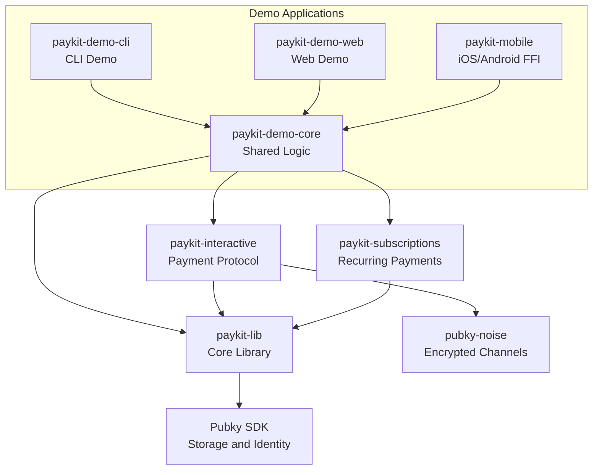
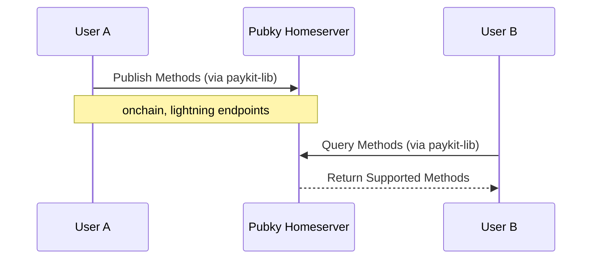
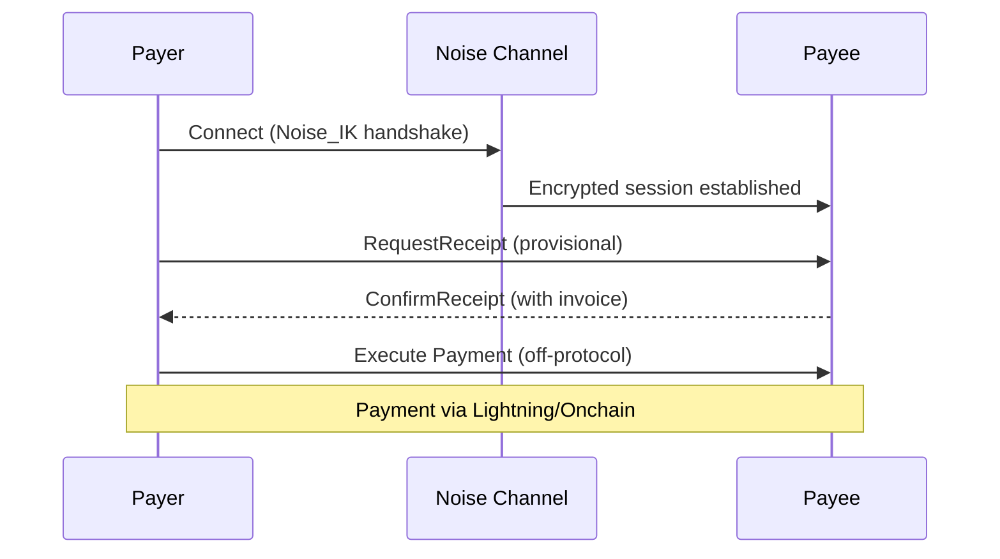
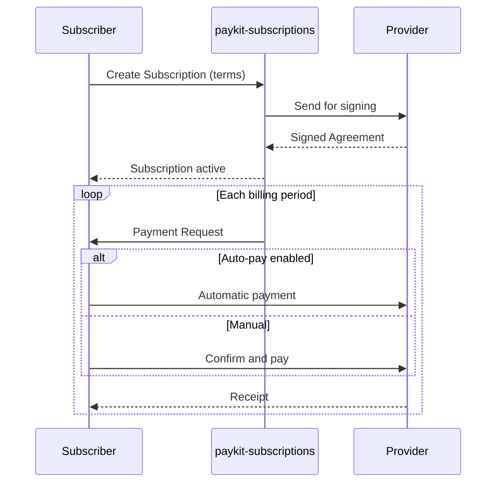
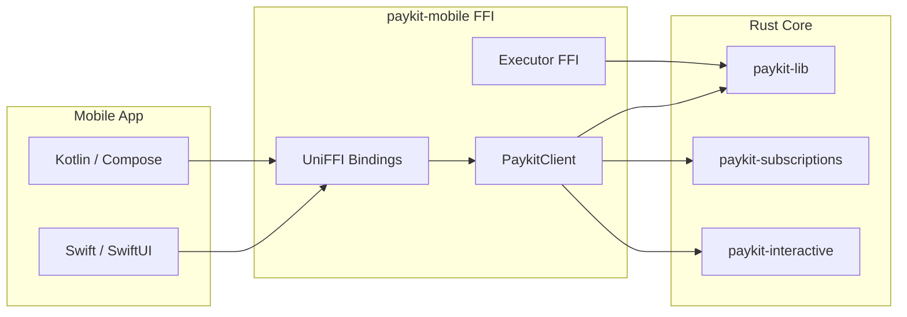
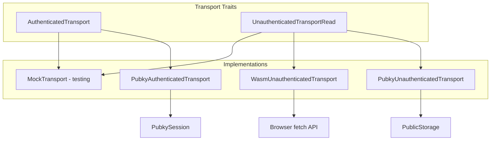

# Paykit Architecture

This document describes the architecture of the Paykit project, including component relationships, data flows, and key design decisions.

## Component Overview

Paykit is organized into six main components:



## Component Dependencies

### paykit-lib
**Foundation layer** - No dependencies on other Paykit components
- Provides transport traits for authenticated and unauthenticated operations
- Implements public directory operations for payment method discovery
- Pubky homeserver integration
- Used by: All other Paykit components

### paykit-interactive
**Payment protocol layer** - Depends on: `paykit-lib`
- Interactive payment protocol using Noise encryption
- Receipt negotiation and exchange
- Private endpoint sharing
- Payment coordination over encrypted channels

### paykit-subscriptions
**Subscription layer** - May use: `paykit-lib` (for directory operations)
- Subscription agreements with cryptographic signatures
- Payment requests with expiration and metadata
- Auto-pay rules with spending limits
- Thread-safe nonce tracking

### paykit-demo-core
**Shared demo logic** - Depends on: `paykit-lib`, `paykit-interactive`, `paykit-subscriptions`
- Identity management (Ed25519/X25519 keypairs)
- Directory client wrapper
- Payment coordinator
- Storage abstraction
- Contact management
- Used by: `paykit-demo-cli`, `paykit-demo-web`

### paykit-demo-cli
**CLI application** - Depends on: `paykit-demo-core`, `paykit-lib`, `paykit-interactive`, `paykit-subscriptions`
- Command-line interface for all Paykit features
- File-based storage
- Terminal UI with colors and QR codes

### paykit-demo-web
**Web application** - Depends on: `paykit-demo-core`, `paykit-lib`, `paykit-subscriptions` (WASM)
- WebAssembly browser application
- localStorage persistence
- Interactive dashboard
- WebSocket-based Noise transport

## Data Flow

### Payment Discovery Flow



### Interactive Payment Flow



### Subscription Flow



## Mobile FFI Architecture

The `paykit-mobile` crate provides UniFFI bindings for iOS and Android integration:



## Storage Architecture

```mermaid
flowchart TB
    subgraph local [Local Storage]
        CLI_STORE[CLI: ~/.paykit/*]
        WEB_STORE[Web: localStorage]
        IOS_STORE[iOS: Keychain]
        ANDROID_STORE[Android: EncryptedSharedPreferences]
    end

    subgraph pubky [Pubky Homeserver]
        PUBLIC[/pub/paykit.app/v0/methodId]
        FOLLOWS[/pub/pubky.app/follows/]
    end

    subgraph noise [Encrypted Channels]
        PRIVATE[Private Endpoints via Noise]
    end

    CLI_STORE --> pubky
    WEB_STORE --> pubky
    IOS_STORE --> pubky
    ANDROID_STORE --> pubky
    pubky <--> noise
```

### Storage Paths

| Platform | Location | Encryption |
|----------|----------|------------|
| CLI | `~/.paykit/` | Plaintext JSON (demo) |
| Web | localStorage | Browser-managed |
| iOS | Keychain Services | Hardware-backed |
| Android | EncryptedSharedPreferences | Hardware-backed keystore |
| Pubky | Homeserver paths | Signature-verified |

## Security Model

### Cryptographic Primitives
- **Ed25519**: Identity and signature operations
- **X25519**: Key exchange for Noise protocol
- **SHA-256**: Message hashing
- **Noise Protocol**: End-to-end encryption

### Key Management
- **Demo**: Plaintext JSON files (development only)
- **Production**: Should use HSMs, secure enclaves, or OS keychain

### Replay Protection
- Unique nonces for all signatures
- Timestamp and expiration validation
- Nonce store for subscription signatures

## Transport Layer



### Authenticated Transport
- Requires `PubkySession` or equivalent
- Used for: Publishing payment methods, writing private data
- Trait: `AuthenticatedTransport`

### Unauthenticated Transport
- Requires `PublicStorage` or equivalent
- Used for: Reading public directory, discovering methods
- Trait: `UnauthenticatedTransportRead`

## Related Documentation

- [Repository Root README](../README.md)
- [Component READMEs](../README.md#documentation)
- [Security Guide](../SECURITY.md)

