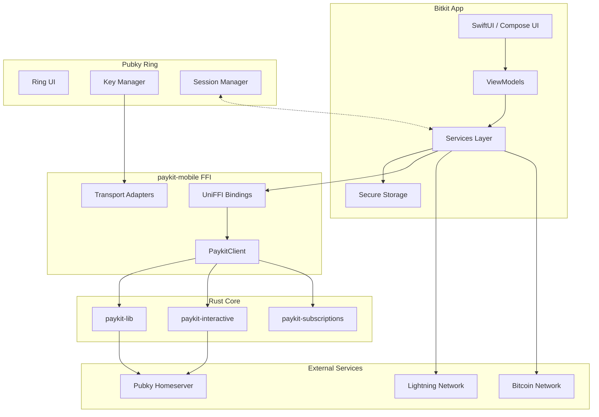
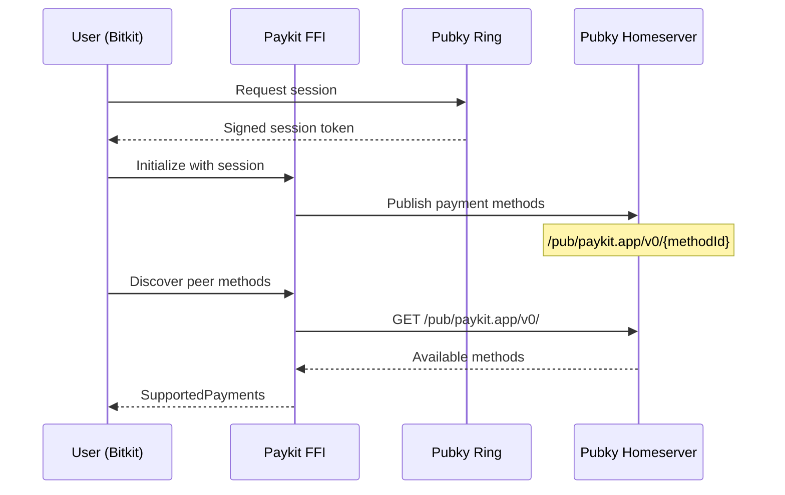

# Bitkit + Paykit Integration Master Guide

> **For Synonym Development Team**  
> **Version**: 1.0  
> **Last Updated**: December 22, 2025  
> **Status**: Reference Implementation Complete

This guide documents the complete integration of Paykit into Bitkit iOS, Bitkit Android, and Pubky Ring. It serves as a detailed map for production developers to follow, including all steps, quirks, stubs, and future work.

---

## Table of Contents

1. [Executive Summary](#1-executive-summary)
2. [Architecture Overview](#2-architecture-overview)
3. [Prerequisites](#3-prerequisites)
4. [Building paykit-rs](#4-building-paykit-rs)
5. [iOS Integration](#5-ios-integration)
6. [Android Integration](#6-android-integration)
7. [Pubky Ring Integration](#7-pubky-ring-integration)
8. [Feature Implementation Guide](#8-feature-implementation-guide)
9. [Known Quirks & Footguns](#9-known-quirks--footguns)
10. [Stubs & Mocks Inventory](#10-stubs--mocks-inventory)
11. [Testing Requirements](#11-testing-requirements)
12. [Production Configuration](#12-production-configuration)
13. [Security Checklist](#13-security-checklist)
14. [Troubleshooting](#14-troubleshooting)
15. [Future Work](#15-future-work)

---

## 1. Executive Summary

### What is Paykit?

Paykit is a decentralized payment protocol built on Pubky that enables:
- **Payment Method Discovery**: Query public directories to find how someone accepts payments
- **Encrypted Payment Channels**: Noise Protocol (Noise_IK) for secure payment negotiation
- **Multi-Method Support**: Bitcoin onchain, Lightning, and extensible to other methods
- **Subscriptions & Auto-Pay**: Recurring payments with cryptographic agreements

### What This Integration Accomplishes

| Feature | iOS | Android | Ring |
|---------|-----|---------|------|
| Payment Method Discovery | ✅ | ✅ | ✅ |
| Directory Publishing | ✅ | ✅ | ✅ |
| Noise Protocol Payments | ✅ | ✅ | N/A |
| Subscriptions | ✅ | ✅ | N/A |
| Auto-Pay Rules | ✅ | ✅ | N/A |
| Spending Limits | ✅ | ✅ | N/A |
| Smart Checkout | ✅ | ✅ | N/A |
| Cross-App Key Sharing | ✅ | ✅ | ✅ |

### Current Status

| Component | Status | Notes |
|-----------|--------|-------|
| `paykit-lib` | ✅ Production-Ready | Core protocol library |
| `paykit-interactive` | ✅ Production-Ready | Noise payments |
| `paykit-subscriptions` | ✅ Production-Ready | Recurring payments |
| `paykit-mobile` | ✅ Production-Ready | FFI bindings |
| Bitkit iOS Integration | ✅ Demo Complete | Needs production testing |
| Bitkit Android Integration | ✅ Demo Complete | Needs production testing |
| Ring Integration | ✅ Key Sharing Working | Session management complete |

---

## 2. Architecture Overview

### Component Diagram



### Key Architecture: "Cold Pkarr, Hot Noise"

This architecture separates key responsibilities:

| Key Type | Purpose | Storage | Rotation |
|----------|---------|---------|----------|
| **Ed25519 (pkarr)** | Identity, signatures | Ring (cold) | Rarely |
| **X25519 (noise)** | Session encryption | Bitkit (hot) | Per-session |

**Flow:**
1. Ring holds the master Ed25519 identity key ("cold")
2. Bitkit derives X25519 session keys via HKDF ("hot")
3. Noise channels use X25519 for encryption
4. Signatures for subscriptions use Ed25519 from Ring

### Data Flow: Payment Discovery



---

## 3. Prerequisites

### Development Environment

| Tool | Required Version | Purpose |
|------|------------------|---------|
| Rust | 1.70+ (via Rustup, NOT Homebrew) | Build paykit-rs |
| UniFFI | 0.25+ | Generate FFI bindings |
| Xcode | 14+ | iOS build |
| Swift | 5.5+ | iOS bindings |
| Android Studio | Latest | Android build |
| Kotlin | 1.8+ | Android bindings |
| Android NDK | r25+ | Native library compilation |

### ⚠️ CRITICAL: Rust Installation

**DO NOT use Homebrew Rust.** WASM targets and cross-compilation require Rustup.

```bash
# If you have Homebrew Rust, remove it first
brew uninstall rust

# Install Rustup
curl --proto '=https' --tlsv1.2 -sSf https://sh.rustup.rs | sh

# Add targets
rustup target add aarch64-apple-ios
rustup target add aarch64-apple-ios-sim
rustup target add x86_64-apple-ios
rustup target add aarch64-linux-android
rustup target add armv7-linux-androideabi
rustup target add i686-linux-android
rustup target add x86_64-linux-android
rustup target add wasm32-unknown-unknown
```

### Repository Setup

Clone all required repositories:

```bash
mkdir -p ~/vibes-dev && cd ~/vibes-dev

# Core Paykit
git clone https://github.com/synonymdev/paykit-rs.git

# Mobile apps
git clone https://github.com/synonymdev/bitkit-ios.git
git clone https://github.com/synonymdev/bitkit-android.git

# Pubky ecosystem
git clone https://github.com/pubky/pubky-ring.git
git clone https://github.com/pubky/pubky-noise.git
git clone https://github.com/pubky/pubky-core.git
```

---

## 4. Building paykit-rs

### Step 1: Build the Core Library

```bash
cd ~/vibes-dev/paykit-rs

# Build release for current platform
cargo build --release -p paykit-mobile

# Verify build artifacts
ls -la target/release/libpaykit_mobile.*
# Should see: libpaykit_mobile.dylib (macOS) or .so (Linux)
```

### Step 2: Generate FFI Bindings

```bash
# Install uniffi-bindgen if not installed
cargo install uniffi-bindgen-cli@0.25

# Generate Swift bindings
uniffi-bindgen generate \
    --library target/release/libpaykit_mobile.dylib \
    -l swift \
    -o generated-bindings/swift/

# Generate Kotlin bindings
uniffi-bindgen generate \
    --library target/release/libpaykit_mobile.dylib \
    -l kotlin \
    -o generated-bindings/uniffi/
```

### Step 3: Build for iOS (All Architectures)

```bash
cd paykit-mobile

# Run the iOS build script
./build-ios.sh

# This creates:
# - target/aarch64-apple-ios/release/libpaykit_mobile.a
# - target/aarch64-apple-ios-sim/release/libpaykit_mobile.a
# - target/x86_64-apple-ios/release/libpaykit_mobile.a
```

### Step 4: Build for Android (All ABIs)

```bash
# Set NDK path
export ANDROID_NDK_HOME=$HOME/Library/Android/sdk/ndk/25.2.9519653

# Run the Android build script
./build-android.sh

# This creates libraries for each ABI:
# - jniLibs/arm64-v8a/libpaykit_mobile.so
# - jniLibs/armeabi-v7a/libpaykit_mobile.so
# - jniLibs/x86/libpaykit_mobile.so
# - jniLibs/x86_64/libpaykit_mobile.so
```

---

## 5. iOS Integration

### Step 1: Add Framework to Xcode

1. **Copy files to project:**
   ```
   Bitkit/
   └── PaykitIntegration/
       ├── FFI/
       │   ├── paykit_mobile.swift      # Generated bindings
       │   └── PaykitMobileFFI.h        # C header
       ├── Frameworks/
       │   └── libpaykit_mobile.a       # Static library
       └── Services/
           ├── PaykitManager.swift
           ├── DirectoryService.swift
           └── NoisePaymentService.swift
   ```

2. **Configure Xcode project:**
   - Add `PaykitIntegration` folder to project
   - Go to **Build Settings** → **Library Search Paths**:
     ```
     $(PROJECT_DIR)/Bitkit/PaykitIntegration/Frameworks
     ```
   - Go to **Build Settings** → **Other Linker Flags**:
     ```
     -lpaykit_mobile
     ```

3. **Add bridging header** (if not already present):
   ```c
   // Bitkit-Bridging-Header.h
   #import "PaykitMobileFFI.h"
   ```

### Step 2: Initialize PaykitManager

```swift
// In AppScene.swift or app initialization
import PaykitMobile

@main
struct BitkitApp: App {
    init() {
        // Initialize Paykit early
        Task {
            await PaykitManager.shared.initialize()
        }
    }
}

// PaykitManager.swift
@Observable
public class PaykitManager {
    public static let shared = PaykitManager()
    
    private var client: PaykitClient?
    public var isReady: Bool = false
    
    public func initialize() async {
        do {
            client = try PaykitClient()
            isReady = true
        } catch {
            Logger.error("Paykit init failed: \(error)")
        }
    }
}
```

### Step 3: Implement Transport Callbacks

The transport layer bridges Paykit to actual Pubky homeserver operations:

```swift
// DirectoryService.swift
class DirectoryTransportCallback: AuthenticatedTransportCallback {
    func upsertPaymentEndpoint(methodId: String, endpointData: String) async throws {
        // Call Pubky SDK to write to homeserver
        let path = "/pub/paykit.app/v0/\(methodId)"
        try await PubkySession.shared.put(path: path, data: endpointData.data(using: .utf8)!)
    }
    
    func removePaymentEndpoint(methodId: String) async throws {
        let path = "/pub/paykit.app/v0/\(methodId)"
        try await PubkySession.shared.delete(path: path)
    }
    
    func fetchPaymentEndpoint(methodId: String) async throws -> String? {
        let path = "/pub/paykit.app/v0/\(methodId)"
        guard let data = try await PubkySession.shared.get(path: path) else {
            return nil
        }
        return String(data: data, encoding: .utf8)
    }
}
```

### Step 4: Register Deep Links

In `Info.plist`, add URL schemes:

```xml
<key>CFBundleURLTypes</key>
<array>
    <dict>
        <key>CFBundleURLSchemes</key>
        <array>
            <string>bitkit</string>
            <string>paykit</string>
            <string>pubky</string>
        </array>
    </dict>
</array>
```

Handle in `AppDelegate` or `SceneDelegate`:

```swift
func application(_ app: UIApplication, open url: URL, options: ...) -> Bool {
    if url.scheme == "pubky" || url.scheme == "paykit" {
        Task {
            await handlePaykitDeepLink(url)
        }
        return true
    }
    return false
}

func handlePaykitDeepLink(_ url: URL) async {
    // pubky://8pinxxgqs41n4aididenw5apqp1urfmzdztr8jt4abrkdn435ewo
    guard let host = url.host else { return }
    
    // Discover payment methods for this pubkey
    let methods = try await PaykitManager.shared.discoverMethods(pubkey: host)
    
    // Show smart checkout
    await MainActor.run {
        NavigationViewModel.shared.navigate(to: .smartCheckout(pubkey: host, methods: methods))
    }
}
```

### Step 5: Implement Keychain Storage

```swift
// PaykitKeychainStorage.swift
import Security

class PaykitKeychainStorage {
    private let service = "to.bitkit.paykit"
    
    func save(key: String, data: Data) throws {
        let query: [String: Any] = [
            kSecClass as String: kSecClassGenericPassword,
            kSecAttrService as String: service,
            kSecAttrAccount as String: key,
            kSecValueData as String: data,
            kSecAttrAccessible as String: kSecAttrAccessibleAfterFirstUnlock
        ]
        
        SecItemDelete(query as CFDictionary)
        let status = SecItemAdd(query as CFDictionary, nil)
        guard status == errSecSuccess else {
            throw KeychainError.saveFailed(status)
        }
    }
    
    func load(key: String) throws -> Data? {
        let query: [String: Any] = [
            kSecClass as String: kSecClassGenericPassword,
            kSecAttrService as String: service,
            kSecAttrAccount as String: key,
            kSecReturnData as String: true
        ]
        
        var result: AnyObject?
        let status = SecItemCopyMatching(query as CFDictionary, &result)
        
        if status == errSecItemNotFound { return nil }
        guard status == errSecSuccess else {
            throw KeychainError.loadFailed(status)
        }
        return result as? Data
    }
}
```

---

## 6. Android Integration

### Step 1: Add JNI Libraries

1. **Copy SO files:**
   ```
   app/src/main/jniLibs/
   ├── arm64-v8a/
   │   └── libpaykit_mobile.so
   ├── armeabi-v7a/
   │   └── libpaykit_mobile.so
   ├── x86/
   │   └── libpaykit_mobile.so
   └── x86_64/
       └── libpaykit_mobile.so
   ```

2. **Copy Kotlin bindings:**
   ```
   app/src/main/java/uniffi/paykit_mobile/
   └── paykit_mobile.kt
   ```

### Step 2: Configure Gradle

```kotlin
// app/build.gradle.kts
android {
    defaultConfig {
        ndk {
            abiFilters += listOf("arm64-v8a", "armeabi-v7a", "x86", "x86_64")
        }
    }
    
    sourceSets {
        getByName("main") {
            jniLibs.srcDirs("src/main/jniLibs")
        }
    }
}

dependencies {
    implementation("net.java.dev.jna:jna:5.13.0@aar")
}
```

### Step 3: Initialize PaykitManager

```kotlin
// PaykitManager.kt
@Singleton
class PaykitManager @Inject constructor(
    @ApplicationContext private val context: Context
) {
    private var client: PaykitClient? = null
    
    val isReady: Boolean
        get() = client != null
    
    suspend fun initialize() = withContext(Dispatchers.IO) {
        try {
            // Load native library
            System.loadLibrary("paykit_mobile")
            client = PaykitClient()
        } catch (e: Exception) {
            Logger.error("Paykit init failed", e = e, context = TAG)
        }
    }
    
    companion object {
        private const val TAG = "PaykitManager"
    }
}
```

### Step 4: Implement Encrypted Storage

```kotlin
// PaykitSecureStorage.kt
class PaykitSecureStorage(context: Context) {
    private val masterKey = MasterKey.Builder(context)
        .setKeyScheme(MasterKey.KeyScheme.AES256_GCM)
        .build()
    
    private val prefs = EncryptedSharedPreferences.create(
        context,
        "paykit_secure_prefs",
        masterKey,
        EncryptedSharedPreferences.PrefKeyEncryptionScheme.AES256_SIV,
        EncryptedSharedPreferences.PrefValueEncryptionScheme.AES256_GCM
    )
    
    fun save(key: String, value: String) {
        prefs.edit().putString(key, value).apply()
    }
    
    fun load(key: String): String? {
        return prefs.getString(key, null)
    }
}
```

### Step 5: Register Deep Links

```xml
<!-- AndroidManifest.xml -->
<activity android:name=".ui.MainActivity">
    <intent-filter>
        <action android:name="android.intent.action.VIEW" />
        <category android:name="android.intent.category.DEFAULT" />
        <category android:name="android.intent.category.BROWSABLE" />
        <data android:scheme="bitkit" />
        <data android:scheme="paykit" />
        <data android:scheme="pubky" />
    </intent-filter>
</activity>
```

Handle in ViewModel:

```kotlin
// AppViewModel.kt
fun handleDeepLink(uri: Uri) {
    when (uri.scheme) {
        "pubky", "paykit" -> {
            val pubkey = uri.host ?: return
            viewModelScope.launch {
                val methods = paykitManager.discoverMethods(pubkey)
                _uiState.update { it.copy(smartCheckoutData = SmartCheckoutData(pubkey, methods)) }
            }
        }
    }
}
```

---

## 7. Pubky Ring Integration

### Overview

Pubky Ring is a separate app that manages identity keys. Bitkit communicates with Ring to:
1. Get the user's Pubky identity (Ed25519 public key)
2. Request signatures for subscriptions
3. Establish authenticated sessions with homeservers

### Cross-App Communication (iOS)

```swift
// PubkyRingBridge.swift
class PubkyRingBridge {
    static let shared = PubkyRingBridge()
    
    /// Request current identity from Ring
    func requestIdentity() async throws -> String {
        let url = URL(string: "pubkyring://identity/current")!
        
        // Use URL scheme to open Ring and get callback
        await UIApplication.shared.open(url)
        
        // Ring will callback with: bitkit://pubky-identity?pubkey=...
        // Handle in deep link handler
    }
    
    /// Request signature from Ring
    func requestSignature(message: Data) async throws -> Data {
        let messageB64 = message.base64EncodedString()
        let url = URL(string: "pubkyring://sign?message=\(messageB64)&callback=bitkit://signature")!
        
        await UIApplication.shared.open(url)
        // Ring will callback with: bitkit://signature?sig=...
    }
}
```

### Cross-App Communication (Android)

```kotlin
// PubkyRingBridge.kt
class PubkyRingBridge(private val context: Context) {
    
    fun requestIdentity(): String? {
        val intent = Intent().apply {
            action = "to.pubky.ring.ACTION_GET_IDENTITY"
            addCategory(Intent.CATEGORY_DEFAULT)
        }
        
        // Use startActivityForResult pattern
        // Ring returns: intent.getStringExtra("pubkey")
    }
    
    fun requestSignature(message: ByteArray): ByteArray? {
        val intent = Intent().apply {
            action = "to.pubky.ring.ACTION_SIGN"
            putExtra("message", message)
        }
        // Ring returns: intent.getByteArrayExtra("signature")
    }
}
```

### Session Management

```swift
// Bitkit requests a session from Ring
let session = try await PubkyRingBridge.shared.requestSession()

// Session contains:
// - pubkey: User's Ed25519 public key (z-base-32 encoded)
// - sessionToken: Signed session token for homeserver auth
// - expiresAt: Session expiration timestamp

// Initialize transport with session
let transport = AuthenticatedTransportFfi.fromCallback(callback: DirectoryCallback(session: session))
```

---

## 8. Feature Implementation Guide

### 8.1 Payment Method Discovery

**Publishing your payment methods:**

```swift
// Publish onchain address
try await paykitClient.publishPaymentMethod(
    methodId: "onchain",
    endpoint: "bc1qxy2kgdygjrsqtzq2n0yrf2493p83kkfjhx0wlh"
)

// Publish Lightning node
try await paykitClient.publishPaymentMethod(
    methodId: "lightning",
    endpoint: "03abc...@node.example.com:9735"
)
```

**Discovering peer methods:**

```swift
let pubkey = "8pinxxgqs41n4aididenw5apqp1urfmzdztr8jt4abrkdn435ewo"
let methods = try await paykitClient.discoverMethods(pubkey: pubkey)

for method in methods.entries {
    print("Method: \(method.methodId) -> \(method.endpoint)")
}
```

### 8.2 Smart Checkout

```swift
// Get optimal payment method for amount
let result = try await paykitClient.smartCheckout(
    peerPubkey: pubkey,
    amountSats: 50000,
    strategy: .balanced  // or .cost, .speed, .privacy
)

switch result.method {
case "lightning":
    // Request invoice and pay via LDK
case "onchain":
    // Send to Bitcoin address
case "noise":
    // Establish Noise channel for private payment
}
```

### 8.3 Noise Protocol Payments

```swift
// 1. Establish encrypted channel
let channel = try await NoiseChannelManager.shared.connect(
    peerPubkey: pubkey,
    peerEndpoint: "wss://peer.example.com/noise"
)

// 2. Request receipt (invoice)
let receipt = try await channel.requestReceipt(
    amount: 50000,
    memo: "Payment for services"
)

// 3. Pay the invoice via Lightning
let paymentResult = try await LightningService.shared.pay(invoice: receipt.invoice)

// 4. Send payment confirmation
try await channel.confirmPayment(
    receiptId: receipt.id,
    txid: paymentResult.txid
)
```

### 8.4 Subscriptions

```swift
// Create subscription
let subscription = try await paykitClient.createSubscription(
    providerPubkey: providerPubkey,
    amount: 10000,
    currency: "SAT",
    frequency: .monthly,
    description: "Premium membership"
)

// Enable auto-pay for this subscription
try await paykitClient.enableAutoPay(
    subscriptionId: subscription.id,
    maxAmountSats: 15000,
    requireConfirmation: false
)
```

### 8.5 Spending Limits

```swift
// Set global daily limit
try await paykitClient.setGlobalDailyLimit(amountSats: 100000)

// Set per-peer limit
try await paykitClient.setPeerLimit(
    peerPubkey: merchantPubkey,
    amountSats: 50000,
    period: .weekly
)

// Check remaining limit before payment
let remaining = try await paykitClient.getRemainingLimit(peerPubkey: merchantPubkey)
if remaining >= paymentAmount {
    // Proceed with payment
}
```

---

## 9. Known Quirks & Footguns

### 9.1 Build Issues

#### ⚠️ Homebrew Rust vs Rustup

**Problem:** Homebrew Rust doesn't support cross-compilation targets.

**Symptom:**
```
Error: wasm32-unknown-unknown target not found in sysroot
```

**Solution:**
```bash
brew uninstall rust
curl --proto '=https' --tlsv1.2 -sSf https://sh.rustup.rs | sh
rustup target add wasm32-unknown-unknown
```

#### ⚠️ WASM async_trait Send Bounds

**Problem:** `async_trait` requires `Send` by default, but WASM futures aren't `Send`.

**Symptom:**
```
future cannot be sent between threads safely
```

**Solution:** Use conditional compilation:
```rust
#[cfg_attr(not(target_arch = "wasm32"), async_trait)]
#[cfg_attr(target_arch = "wasm32", async_trait(?Send))]
pub trait PrivateEndpointStore: Send + Sync {
    // ...
}
```

#### ⚠️ UniFFI Version Mismatch

**Problem:** Generated bindings must match the UniFFI version used to build.

**Symptom:**
```
uniffi checksum mismatch
```

**Solution:** Always regenerate bindings after updating UniFFI:
```bash
cargo install uniffi-bindgen-cli@0.25  # Match Cargo.toml version
./paykit-mobile/generate-bindings.sh
```

#### ⚠️ Android NDK Path

**Problem:** Build scripts can't find NDK.

**Solution:** Set environment variable:
```bash
export ANDROID_NDK_HOME=$HOME/Library/Android/sdk/ndk/25.2.9519653
```

Also create `local.properties` in Android project:
```properties
sdk.dir=/Users/YOUR_USER/Library/Android/sdk
```

### 9.2 Runtime Issues

#### ⚠️ Thread Safety with Noise Channels

**Problem:** Noise channels are not `Send` - cannot be used across threads.

**Solution:** Keep channel operations on the same thread/task:
```swift
// WRONG
Task.detached {
    await channel.send(message)  // May be different thread
}

// RIGHT
await withCheckedContinuation { continuation in
    channelQueue.async {
        channel.send(message)
        continuation.resume()
    }
}
```

#### ⚠️ Lock Poisoning Policy

**Problem:** Mutex poisoning after panic can cause cascading failures.

**Policy:** We use `lock().expect()` and accept panics on poison.

**Rationale:** If a thread panics while holding a lock, the data may be corrupt. Better to crash than corrupt payments.

See: `paykit-rs/docs/CONCURRENCY.md`

#### ⚠️ Never Call block_on() in Async Context

**Problem:** Calling `block_on()` from an async task deadlocks.

**Symptom:** App hangs indefinitely.

**Solution:** Use the FFI's async bridge:
```kotlin
// WRONG
runBlocking {
    paykitClient.discover(pubkey)
}

// RIGHT
viewModelScope.launch {
    paykitClient.discoverAsync(pubkey)
}
```

### 9.3 Platform-Specific Issues

#### iOS Keychain Entitlements

**Problem:** Keychain access fails without proper entitlements.

**Solution:** Add to `Bitkit.entitlements`:
```xml
<key>keychain-access-groups</key>
<array>
    <string>$(AppIdentifierPrefix)to.bitkit.paykit</string>
</array>
```

#### Android ProGuard Rules

**Problem:** ProGuard strips JNA classes.

**Solution:** Add to `proguard-rules.pro`:
```proguard
-keep class com.sun.jna.** { *; }
-keep class uniffi.paykit_mobile.** { *; }
```

#### Background Processing Limits

**Problem:** iOS kills background tasks after ~30 seconds.

**Solution:** Use `BGProcessingTask` for subscription checks:
```swift
BGTaskScheduler.shared.register(
    forTaskWithIdentifier: "to.bitkit.paykit.subscriptionCheck",
    using: nil
) { task in
    self.handleSubscriptionCheck(task as! BGProcessingTask)
}
```

---

## 10. Stubs & Mocks Inventory

### Components Still Using Mocks

| Component | Location | What's Mocked | Production Requirement |
|-----------|----------|---------------|------------------------|
| Directory Transport | `paykit-demo-web/src/directory.rs` | localStorage publishing | Real Pubky homeserver |
| Payment Execution | `paykit-lib/src/methods/onchain.rs` | Mock transaction result | Real Esplora/LND executor |
| Noise Transport | Demo apps | TCP/WebSocket | Real Noise over WS |
| Key Storage | `paykit-demo-cli` | Plaintext JSON | OS Keychain/Keystore |

### Mock APIs Available

```rust
// These are for testing ONLY - do not use in production

// Mock transport (no network calls)
let transport = AuthenticatedTransportFfi::new_mock();
assert!(transport.is_mock());  // Returns true

// Production transport
let transport = AuthenticatedTransportFfi::from_callback(callback);
assert!(!transport.is_mock());  // Returns false
```

### Production Transport Implementation

For production, implement the callback interface:

```swift
// iOS
class ProductionTransportCallback: AuthenticatedTransportCallback {
    private let session: PubkySession
    
    func upsertPaymentEndpoint(methodId: String, endpointData: String) async throws {
        // Real homeserver call
        try await session.put(
            path: "/pub/paykit.app/v0/\(methodId)",
            data: endpointData.data(using: .utf8)!
        )
    }
    // ... implement other methods
}
```

### What Needs Real Implementation

| Feature | Demo Behavior | Production Need |
|---------|---------------|-----------------|
| `OnchainPlugin.execute()` | Returns mock txid | Connect to Esplora/electrum |
| `LightningPlugin.execute()` | Returns mock preimage | Connect to LND/CLN/LDK |
| `NoiseServerHelper` | In-memory | Persistent connection state |
| `FileStorage` | Plaintext JSON | Encrypted database |

---

## 11. Testing Requirements

### 11.1 Unit Tests

**Location:** Each crate's `tests/` directory

**Run all tests:**
```bash
cd paykit-rs
cargo test --all --all-features
```

**Key test files:**
- `paykit-lib/tests/methods_test.rs` - Payment method validation
- `paykit-subscriptions/tests/subscription_test.rs` - Subscription lifecycle
- `paykit-interactive/tests/protocol_test.rs` - Noise protocol messages

### 11.2 Integration Tests

**Run with network access:**
```bash
cargo test --features integration-tests -- --test-threads=1
```

**Disabled tests (need SDK update):**
- `pubky_sdk_compliance.rs` - Pubky SDK API changed

### 11.3 Mobile Tests

**iOS:**
```bash
cd bitkit-ios
xcodebuild test -scheme Bitkit -destination 'platform=iOS Simulator,name=iPhone 15'
```

**Android:**
```bash
cd bitkit-android
./gradlew testDevDebugUnitTest
./gradlew connectedDevDebugAndroidTest
```

### 11.4 Manual Test Checklist

Before release, manually verify:

- [ ] Create identity in Ring
- [ ] Import identity in Bitkit
- [ ] Publish payment methods
- [ ] Scan QR code for Pubky URI
- [ ] Smart checkout flow completes
- [ ] Lightning payment executes
- [ ] Onchain payment executes
- [ ] Create subscription
- [ ] Auto-pay triggers correctly
- [ ] Spending limit enforced
- [ ] Deep links work (all schemes)
- [ ] Background subscription check runs
- [ ] App recovers from network failure
- [ ] Keys persist across app restart

### 11.5 E2E Test Scenarios

```bash
# Start test environment
cd paykit-rs
./scripts/start-testnet.sh

# Run E2E tests
cargo test --features e2e-tests
```

---

## 12. Production Configuration

### Environment Variables

| Variable | Description | Example |
|----------|-------------|---------|
| `PAYKIT_HOMESERVER_URL` | Pubky homeserver URL | `https://homeserver.pubky.org` |
| `PAYKIT_LOG_LEVEL` | Logging verbosity | `info`, `debug`, `trace` |
| `PAYKIT_RATE_LIMIT_BURST` | Rate limit burst size | `10` |
| `PAYKIT_RATE_LIMIT_PERIOD_SECS` | Rate limit window | `60` |

### iOS Configuration

```swift
// Config.swift
struct PaykitConfig {
    static let homeserverURL = ProcessInfo.processInfo.environment["PAYKIT_HOMESERVER_URL"] 
        ?? "https://homeserver.pubky.org"
    
    static let rateLimitConfig = RateLimitConfig(
        maxHandshakesPerMinute: 10,
        maxHandshakesGlobal: 100
    )
}
```

### Android Configuration

```kotlin
// PaykitConfig.kt
object PaykitConfig {
    val homeserverUrl: String = BuildConfig.PAYKIT_HOMESERVER_URL
    
    val rateLimitConfig = RateLimitConfig(
        maxHandshakesPerMinute = 10,
        maxHandshakesGlobal = 100
    )
}
```

### Server Requirements

| Service | Purpose | Minimum Spec |
|---------|---------|--------------|
| Pubky Homeserver | Directory storage | 2 CPU, 4GB RAM |
| Lightning Node | Payment execution | 4 CPU, 8GB RAM |
| Bitcoin Node | Onchain payments | 8 CPU, 16GB RAM |

---

## 13. Security Checklist

### Cryptographic Requirements

- [x] Ed25519 for identity and signatures
- [x] X25519 for Noise key exchange
- [x] HKDF for key derivation
- [x] AES-256-GCM for storage encryption
- [x] Argon2 for password-based key derivation

### Key Storage

- [ ] iOS: Keys in Keychain with `kSecAttrAccessibleAfterFirstUnlock`
- [ ] Android: Keys in EncryptedSharedPreferences with hardware-backed keystore
- [ ] Never log keys or secrets
- [ ] Zeroize sensitive data after use

### Transport Security

- [ ] TLS 1.3 for all HTTP connections
- [ ] Certificate pinning for homeserver
- [ ] Noise_IK for payment channels
- [ ] No sensitive data in URLs

### Input Validation

- [ ] Validate all pubkeys are valid z-base-32
- [ ] Validate all amounts are positive
- [ ] Sanitize paths (no `..` traversal)
- [ ] Validate invoice expiration before payment

### Replay Protection

- [ ] Nonces stored in persistent database
- [ ] Nonce checked BEFORE signature verification
- [ ] Expired nonces cleaned up automatically
- [ ] Timestamps validated (not future-dated)

---

## 14. Troubleshooting

### Build Errors

**"Library not found for -lpaykit_mobile"**
- Check Library Search Paths in Xcode
- Verify `.a` file is in the correct location
- Run `cargo build --release -p paykit-mobile`

**"uniffi checksum mismatch"**
- Regenerate bindings with matching UniFFI version
- Delete derived data and rebuild

**"wasm32-unknown-unknown target not found"**
- Switch from Homebrew Rust to Rustup
- Run `rustup target add wasm32-unknown-unknown`

### Runtime Errors

**"Failed to load native library"**
- Check SO files are in correct jniLibs folders
- Verify ABI filters in build.gradle match
- Check ProGuard isn't stripping JNA

**"Keychain access denied"**
- Add keychain-access-groups entitlement
- Check app identifier prefix

**"Session expired"**
- Request new session from Ring
- Check system clock is accurate

### Network Errors

**"Homeserver unreachable"**
- Check network connectivity
- Verify homeserver URL is correct
- Check for certificate issues

**"Noise handshake failed"**
- Verify peer pubkey is correct
- Check rate limiting isn't triggered
- Ensure both sides support Noise_IK

---

## 15. Future Work

### Planned Features

| Feature | Priority | Status |
|---------|----------|--------|
| Hardware wallet signing | High | Not started |
| Multi-signature support | Medium | Design phase |
| LNURL integration | Medium | Planned |
| Bolt12 support | Medium | Planned |
| Desktop Electron app | Low | Not started |

### Known Limitations

1. **Single homeserver**: Currently only supports one homeserver per user
2. **No offline payments**: Requires network for all operations
3. **Manual key backup**: No automatic cloud backup
4. **Limited payment proofs**: Basic receipt, not cryptographic proof

### Upgrade Paths

**Pubky SDK Migration:**
When Pubky SDK updates, check:
- `PubkyClient` API changes
- Session management changes
- Homeserver protocol version

**UniFFI Updates:**
When updating UniFFI:
1. Update version in all `Cargo.toml`
2. Regenerate all bindings
3. Test on all platforms

---

## Appendices

### A. File Manifest

**paykit-rs files created/modified:**
```
paykit-mobile/
├── src/lib.rs                    # FFI exports
├── src/interactive_ffi.rs        # Noise protocol FFI
├── src/executor_ffi.rs           # Payment executor FFI
├── swift/                        # iOS storage adapters
└── kotlin/                       # Android storage adapters
```

**bitkit-ios files created:**
```
Bitkit/PaykitIntegration/
├── FFI/paykit_mobile.swift       # Generated bindings
├── Services/PaykitManager.swift
├── Services/DirectoryService.swift
├── Services/NoisePaymentService.swift
├── Storage/PaykitKeychainStorage.swift
└── Views/*.swift                 # UI components
```

**bitkit-android files created:**
```
app/src/main/java/
├── uniffi/paykit_mobile/         # Generated bindings
└── to/bitkit/paykit/
    ├── services/PaykitManager.kt
    ├── services/DirectoryService.kt
    ├── storage/PaykitSecureStorage.kt
    └── ui/screens/*.kt           # UI components
```

### B. Dependency Versions

| Dependency | Version | Notes |
|------------|---------|-------|
| Rust | 1.75+ | Via Rustup |
| UniFFI | 0.25.3 | Must match across all crates |
| Pubky SDK | 0.6.0-rc.6 | API breaking changes pending |
| pubky-noise | latest | Used for Noise protocol |
| LDK Node | 0.3.0 | Lightning payments |

### C. Glossary

| Term | Definition |
|------|------------|
| **Pkarr** | Public Key Addressable Resource Records - DNS-like system for pubkeys |
| **Pubky** | Public Key + Y (identity) - decentralized identity system |
| **Noise Protocol** | Cryptographic handshake framework for secure channels |
| **z-base-32** | Human-friendly encoding for Ed25519 public keys |
| **Homeserver** | Pubky server that stores user data |
| **FFI** | Foreign Function Interface - bridge between Rust and mobile |
| **UniFFI** | Mozilla's tool for generating FFI bindings |

---

*This guide was generated from the reference implementation in the BitcoinErrorLog repositories. For questions, open an issue in the relevant repository.*

