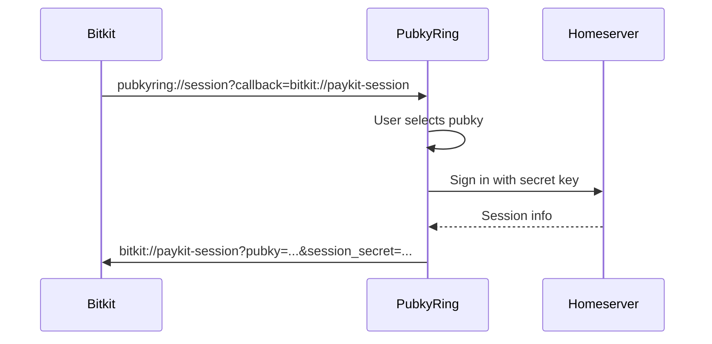
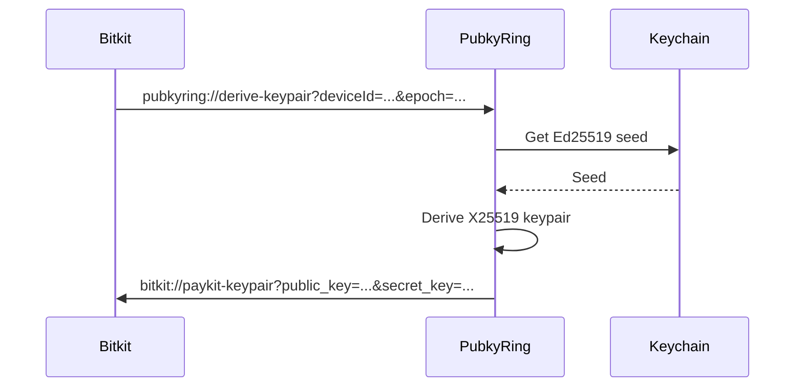

# Pubky-Ring Integration Guide

This document describes how Bitkit integrates with Pubky-ring for session management and key derivation.

## Overview

Pubky-ring is a React Native app that manages Pubky identities and sessions. Bitkit communicates with Pubky-ring via URL schemes (iOS) and Intents (Android) to:

1. **Request sessions** - Get authenticated sessions for Pubky directory operations
2. **Derive noise keys** - Get X25519 keypairs for Noise protocol communication
3. **Import profiles** - Fetch profile data from Pubky directory
4. **Import follows** - Fetch follows list for contact discovery

## Communication Protocol

### URL Scheme Format

```
pubkyring://{action}?{params}&callback={callback_url}
```

### Supported Actions

| Action | Description | Parameters |
|--------|-------------|------------|
| `session` | Request a session | `callback` |
| `derive-keypair` | Request noise keypair | `deviceId`, `epoch`, `callback` |
| `get-profile` | Request profile data | `pubkey`, `callback` |
| `get-follows` | Request follows list | `callback` |

### Callback URL Format

Bitkit registers the `bitkit://` URL scheme and handles callbacks at these paths:

| Path | Purpose | Response Parameters |
|------|---------|---------------------|
| `paykit-session` | Session response | `pubkey`, `session_secret`, `capabilities` |
| `paykit-keypair` | Keypair response | `public_key`, `secret_key`, `device_id`, `epoch` |
| `paykit-profile` | Profile response | `name`, `bio`, `image` |
| `paykit-follows` | Follows response | `follows` (comma-separated pubkeys) |

## Session Request Flow



### Request

```
pubkyring://session?callback=bitkit://paykit-session
```

### Response

```
bitkit://paykit-session?pubkey={pubkey}&session_secret={secret}&capabilities={caps}
```

| Parameter | Description |
|-----------|-------------|
| `pubkey` | The user's public key (z-base32) |
| `session_secret` | Session secret for authenticated requests |
| `capabilities` | Comma-separated list of capabilities |

## Noise Keypair Derivation Flow

Pubky-ring derives X25519 keypairs from the Ed25519 seed, never exposing the seed itself.



### Request

```
pubkyring://derive-keypair?deviceId={id}&epoch={epoch}&callback=bitkit://paykit-keypair
```

| Parameter | Description |
|-----------|-------------|
| `deviceId` | Unique device identifier |
| `epoch` | Key rotation epoch (0-based) |
| `callback` | Callback URL |

### Response

```
bitkit://paykit-keypair?public_key={pk}&secret_key={sk}&device_id={id}&epoch={epoch}
```

| Parameter | Description |
|-----------|-------------|
| `public_key` | X25519 public key (hex) |
| `secret_key` | X25519 secret key (hex) |
| `device_id` | Echo of device ID |
| `epoch` | Echo of epoch |

## iOS Integration

### URL Scheme Registration

Add to `Info.plist`:

```xml
<key>CFBundleURLTypes</key>
<array>
    <dict>
        <key>CFBundleURLSchemes</key>
        <array>
            <string>bitkit</string>
        </array>
        <key>CFBundleURLName</key>
        <string>to.bitkit</string>
    </dict>
</array>
<key>LSApplicationQueriesSchemes</key>
<array>
    <string>pubkyring</string>
</array>
```

### Usage

```swift
import UIKit

// Check if Pubky-ring is installed
let bridge = PubkyRingBridge.shared
if bridge.isPubkyRingInstalled {
    // Request a session
    Task {
        do {
            let session = try await bridge.requestSession()
            print("Got session for: \(session.pubkey)")
        } catch {
            print("Failed to get session: \(error)")
        }
    }
}

// Handle callback in AppDelegate or SceneDelegate
func application(_ app: UIApplication, open url: URL, options: [UIApplication.OpenURLOptionsKey: Any] = [:]) -> Bool {
    if PubkyRingBridge.shared.handleCallback(url: url) {
        return true
    }
    // Handle other URLs...
    return false
}
```

## Android Integration

### Intent Filter Registration

Add to `AndroidManifest.xml`:

```xml
<activity android:name=".ui.MainActivity">
    <intent-filter>
        <action android:name="android.intent.action.VIEW" />
        <category android:name="android.intent.category.DEFAULT" />
        <category android:name="android.intent.category.BROWSABLE" />
        <data android:scheme="bitkit" />
    </intent-filter>
</activity>
```

### Usage

```kotlin
import to.bitkit.paykit.services.PubkyRingBridge

// Check if Pubky-ring is installed
val bridge = PubkyRingBridge.getInstance()
if (bridge.isPubkyRingInstalled(context)) {
    // Request a session
    viewModelScope.launch {
        try {
            val session = bridge.requestSession(context)
            Log.d(TAG, "Got session for: ${session.pubkey}")
        } catch (e: PubkyRingException) {
            Log.e(TAG, "Failed to get session", e)
        }
    }
}

// Handle callback in Activity
override fun onNewIntent(intent: Intent?) {
    super.onNewIntent(intent)
    intent?.data?.let { uri ->
        if (PubkyRingBridge.getInstance().handleCallback(uri)) {
            return
        }
    }
    // Handle other intents...
}
```

## Error Handling

### Common Errors

| Error | Cause | Resolution |
|-------|-------|------------|
| `AppNotInstalled` | Pubky-ring not installed | Prompt user to install |
| `FailedToOpenApp` | Intent/URL scheme failed | Check URL scheme registration |
| `InvalidCallback` | Malformed callback URL | Check Pubky-ring version |
| `MissingParameters` | Required params missing | Check Pubky-ring version |
| `Timeout` | No response within timeout | Retry or show error |
| `Cancelled` | User cancelled in Pubky-ring | Handle gracefully |

### Graceful Degradation

When Pubky-ring is not installed, Bitkit should:

1. Show a message explaining the feature requires Pubky-ring
2. Provide a link to install Pubky-ring
3. Fall back to local key derivation if possible (less secure)

## Security Considerations

1. **Session secrets** should be stored securely (Keychain/EncryptedSharedPreferences)
2. **Noise keypairs** are derived from the Ed25519 seed but the seed is never exposed
3. **Callback URLs** should be validated to prevent spoofing
4. **Capabilities** should be checked before using session for operations

## Testing

### Manual Testing

1. Install both Bitkit and Pubky-ring on test device
2. Create a pubky in Pubky-ring
3. Trigger session request from Bitkit
4. Verify Pubky-ring opens and shows pubky selection
5. Select pubky and verify callback returns to Bitkit
6. Verify session data is received correctly

### E2E Testing

See `e2e/pubky-ring-integration-tests.md` for automated test scenarios.

## Version Compatibility

| Bitkit Version | Pubky-ring Version | Notes |
|----------------|-------------------|-------|
| 1.0.0+ | 1.0.0+ | Initial integration |

## References

- [Pubky-ring Repository](https://github.com/BitcoinErrorLog/pubky-ring)
- [Pubky Protocol Spec](https://github.com/pubky/pubky-core)
- [Noise Protocol](http://noiseprotocol.org/)

