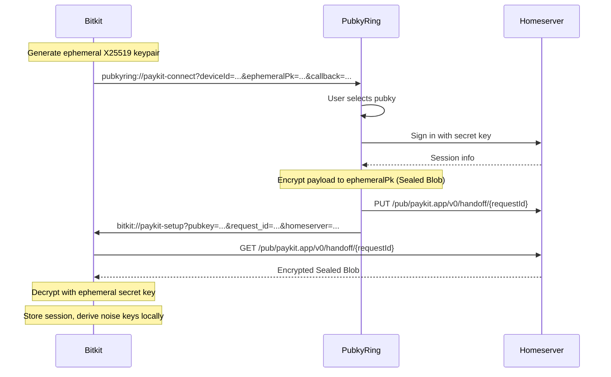
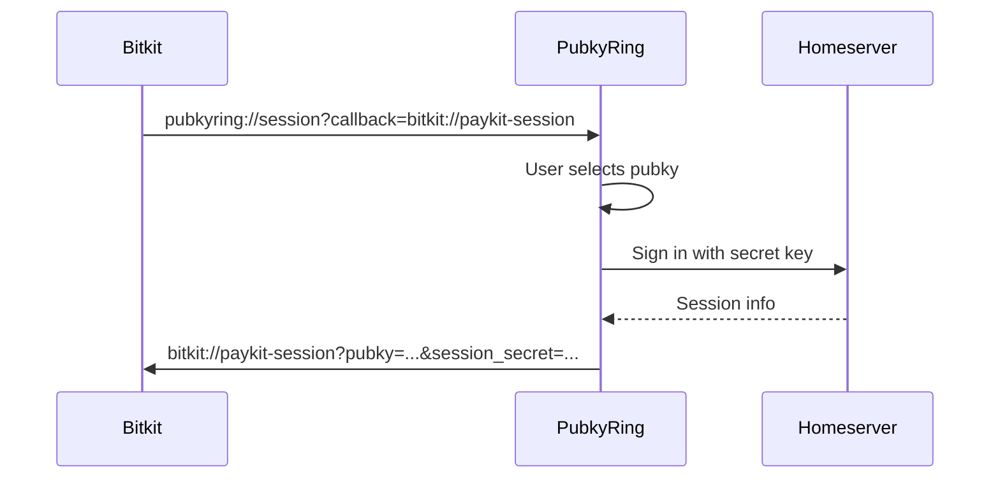

# Pubky-Ring Integration Guide

This document describes how Bitkit integrates with Pubky-ring for session management and key derivation.

## Overview

Pubky-ring is a React Native app that manages Pubky identities and sessions. Bitkit communicates with Pubky-ring via URL schemes (iOS) and Intents (Android) to:

1. **Request sessions** - Get authenticated sessions for Pubky directory operations
2. **Derive noise keys** - Get X25519 keypairs for Noise protocol communication
3. **Import profiles** - Fetch profile data from Pubky directory
4. **Import follows** - Fetch follows list for contact discovery

## Communication Protocol

### URL Scheme Format

```
pubkyring://{action}?{params}&callback={callback_url}
```

### Supported Actions

| Action | Description | Parameters | Status |
|--------|-------------|------------|--------|
| `paykit-connect` | Secure session + noise seed handoff | `deviceId`, `callback`, `ephemeralPk` | **Preferred** |
| `session` | Request a session (legacy) | `callback` | Deprecated |
| `derive-keypair` | Request noise keypair | `deviceId`, `epoch`, `callback` | **Removed** (security) |
| `get-profile` | Request profile data | `pubkey`, `callback` |  |
| `get-follows` | Request follows list | `callback` |  |

> **Security Note**: The `derive-keypair` action has been removed because it exposed secret keys in callback URLs. Use `paykit-connect` instead, which uses encrypted handoff.

### Callback URL Format

Bitkit registers the `bitkit://` URL scheme and handles callbacks at these paths:

| Path | Purpose | Response Parameters |
|------|---------|---------------------|
| `paykit-session` | Session response | `pubkey`, `session_secret`, `capabilities` |
| `paykit-keypair` | Keypair response | `public_key`, `secret_key`, `device_id`, `epoch` |
| `paykit-profile` | Profile response | `name`, `bio`, `image` |
| `paykit-follows` | Follows response | `follows` (comma-separated pubkeys) |

## Secure Handoff Flow (paykit-connect)

The `paykit-connect` action is the **preferred** method for Paykit setup. It provides session credentials and a noise seed in a single encrypted handoff, ensuring secrets are never exposed in URLs.


```mermaid
sequenceDiagram
    participant Bitkit
    participant PubkyRing
    participant Homeserver

    Note over Bitkit: Generate ephemeral X25519 keypair
    Bitkit->>PubkyRing: pubkyring://paykit-connect?deviceId=...&ephemeralPk=...&callback=...
    PubkyRing->>PubkyRing: User selects pubky
    PubkyRing->>Homeserver: Sign in with secret key
    Homeserver-->>PubkyRing: Session info
    Note over PubkyRing: Encrypt payload to ephemeralPk (Sealed Blob)
    PubkyRing->>Homeserver: PUT /pub/paykit.app/v0/handoff/{requestId}
    PubkyRing->>Bitkit: bitkit://paykit-setup?pubkey=...&request_id=...&homeserver=...
    Bitkit->>Homeserver: GET /pub/paykit.app/v0/handoff/{requestId}
    Homeserver-->>Bitkit: Encrypted Sealed Blob
    Note over Bitkit: Decrypt with ephemeral secret key
    Note over Bitkit: Store session, derive noise keys locally
```

### Request

```
pubkyring://paykit-connect?deviceId={id}&callback={url}&ephemeralPk={pk}
```

| Parameter | Description |
|-----------|-------------|
| `deviceId` | Unique device identifier (UUID) |
| `callback` | URL-encoded callback (e.g., `bitkit://paykit-setup`) |
| `ephemeralPk` | Ephemeral X25519 public key (hex, 64 chars) for encrypted response |

### Callback

```
bitkit://paykit-setup?pubkey={pubkey}&request_id={id}&homeserver={url}
```

| Parameter | Description |
|-----------|-------------|
| `pubkey` | User's public key (z-base32) |
| `request_id` | ID to fetch encrypted payload from homeserver |
| `homeserver` | Homeserver URL where payload is stored (optional, defaults to user's homeserver) |

### Encrypted Payload Structure

The payload at `/pub/paykit.app/v0/handoff/{requestId}` is a **Sealed Blob** encrypted to `ephemeralPk`:

```json
{
  "version": 1,
  "pubky": "z-base32 pubkey",
  "session_secret": "hex session secret",
  "capabilities": ["read", "write"],
  "noise_seed": "hex 32-byte seed for local key derivation",
  "timestamp": 1706123456
}
```

| Field | Description |
|-------|-------------|
| `version` | Protocol version (must be `1`) |
| `pubky` | User's z-base32 public key |
| `session_secret` | Hex-encoded session secret for homeserver auth |
| `capabilities` | List of granted capabilities |
| `noise_seed` | 32-byte seed (hex) for deriving X25519 keypairs locally |
| `timestamp` | Unix timestamp in **seconds** when payload was created |

### Local Key Derivation

With the `noise_seed`, Bitkit can derive X25519 keypairs locally without calling Ring again:

```
secret_key = HKDF-SHA256(
  ikm = noise_seed,
  salt = deviceId (UTF-8 bytes),
  info = "noise_key_v1:{epoch}" (UTF-8),
  length = 32
)
public_key = X25519_basepoint(secret_key)
```

### Timestamp Validation

The `timestamp` field uses **Unix seconds** (not milliseconds). Bitkit should:
1. Reject payloads older than 5 minutes (`now - timestamp > 300`)
2. Reject payloads from the future (`timestamp > now + 60`)

## Legacy Session Request Flow (Deprecated)

> **Warning**: This flow is deprecated because it exposes secrets in callback URLs.


```mermaid
sequenceDiagram
    participant Bitkit
    participant PubkyRing
    participant Homeserver

    Bitkit->>PubkyRing: pubkyring://session?callback=bitkit://paykit-session
    PubkyRing->>PubkyRing: User selects pubky
    PubkyRing->>Homeserver: Sign in with secret key
    Homeserver-->>PubkyRing: Session info
    PubkyRing->>Bitkit: bitkit://paykit-session?pubky=...&session_secret=...
```

### Request

```
pubkyring://session?callback=bitkit://paykit-session
```

### Response

```
bitkit://paykit-session?pubkey={pubkey}&session_secret={secret}&capabilities={caps}
```

| Parameter | Description |
|-----------|-------------|
| `pubkey` | The user's public key (z-base32) |
| `session_secret` | Session secret for authenticated requests |
| `capabilities` | Comma-separated list of capabilities |

## Noise Keypair Derivation

### Current Approach: Local Derivation

With `paykit-connect`, Bitkit receives a `noise_seed` and derives keypairs locally:

```kotlin
// Kotlin (Android)
val secretKeyBytes = com.pubky.noise.deriveDeviceKey(
    seedBytes,      // 32-byte noise_seed from handoff
    deviceIdBytes,  // UTF-8 encoded device ID
    epoch,          // UInt: 0, 1, 2, ...
)
val publicKeyBytes = com.pubky.noise.publicKeyFromSecret(secretKeyBytes)
```

```swift
// Swift (iOS)
let secretKey = try NoiseModule.deriveDeviceKey(
    seed: seedBytes,
    deviceId: deviceIdBytes,
    epoch: epoch
)
let publicKey = try NoiseModule.publicKeyFromSecret(secretKey)
```

### Deprecated: URL-Based Derivation (Removed)

> **Security Warning**: The `derive-keypair` action has been **removed** because it exposed X25519 secret keys in callback URLs. Secret keys in URLs are logged by system URL handlers, appear in app history, and can be captured by malicious URL handlers.

If you have code using `derive-keypair`, migrate to `paykit-connect` which provides a `noise_seed` for local derivation.

## iOS Integration

### URL Scheme Registration

Add to `Info.plist`:

```xml
<key>CFBundleURLTypes</key>
<array>
    <dict>
        <key>CFBundleURLSchemes</key>
        <array>
            <string>bitkit</string>
        </array>
        <key>CFBundleURLName</key>
        <string>to.bitkit</string>
    </dict>
</array>
<key>LSApplicationQueriesSchemes</key>
<array>
    <string>pubkyring</string>
</array>
```

### Usage

```swift
import UIKit

// Check if Pubky-ring is installed
let bridge = PubkyRingBridge.shared
if bridge.isPubkyRingInstalled {
    // Request a session
    Task {
        do {
            let session = try await bridge.requestSession()
            print("Got session for: \(session.pubkey)")
        } catch {
            print("Failed to get session: \(error)")
        }
    }
}

// Handle callback in AppDelegate or SceneDelegate
func application(_ app: UIApplication, open url: URL, options: [UIApplication.OpenURLOptionsKey: Any] = [:]) -> Bool {
    if PubkyRingBridge.shared.handleCallback(url: url) {
        return true
    }
    // Handle other URLs...
    return false
}
```

## Android Integration

### Intent Filter Registration

Add to `AndroidManifest.xml`:

```xml
<activity android:name=".ui.MainActivity">
    <intent-filter>
        <action android:name="android.intent.action.VIEW" />
        <category android:name="android.intent.category.DEFAULT" />
        <category android:name="android.intent.category.BROWSABLE" />
        <data android:scheme="bitkit" />
    </intent-filter>
</activity>
```

### Usage

```kotlin
import to.bitkit.paykit.services.PubkyRingBridge

// Check if Pubky-ring is installed
val bridge = PubkyRingBridge.getInstance()
if (bridge.isPubkyRingInstalled(context)) {
    // Request a session
    viewModelScope.launch {
        try {
            val session = bridge.requestSession(context)
            Log.d(TAG, "Got session for: ${session.pubkey}")
        } catch (e: PubkyRingException) {
            Log.e(TAG, "Failed to get session", e)
        }
    }
}

// Handle callback in Activity
override fun onNewIntent(intent: Intent?) {
    super.onNewIntent(intent)
    intent?.data?.let { uri ->
        if (PubkyRingBridge.getInstance().handleCallback(uri)) {
            return
        }
    }
    // Handle other intents...
}
```

## Error Handling

### Common Errors

| Error | Cause | Resolution |
|-------|-------|------------|
| `AppNotInstalled` | Pubky-ring not installed | Prompt user to install |
| `FailedToOpenApp` | Intent/URL scheme failed | Check URL scheme registration |
| `InvalidCallback` | Malformed callback URL | Check Pubky-ring version |
| `MissingParameters` | Required params missing | Check Pubky-ring version |
| `Timeout` | No response within timeout | Retry or show error |
| `Cancelled` | User cancelled in Pubky-ring | Handle gracefully |

### Graceful Degradation

When Pubky-ring is not installed, Bitkit should:

1. Show a message explaining the feature requires Pubky-ring
2. Provide a link to install Pubky-ring
3. Fall back to local key derivation if possible (less secure)

## Security Considerations

1. **Session secrets** should be stored securely (Keychain/EncryptedSharedPreferences)
2. **Noise keypairs** are derived from the Ed25519 seed but the seed is never exposed
3. **Callback URLs** should be validated to prevent spoofing
4. **Capabilities** should be checked before using session for operations

## Testing

### Manual Testing

1. Install both Bitkit and Pubky-ring on test device
2. Create a pubky in Pubky-ring
3. Trigger session request from Bitkit
4. Verify Pubky-ring opens and shows pubky selection
5. Select pubky and verify callback returns to Bitkit
6. Verify session data is received correctly

### E2E Testing

See `e2e/pubky-ring-integration-tests.md` for automated test scenarios.

## Version Compatibility

| Bitkit Version | Pubky-ring Version | Notes |
|----------------|-------------------|-------|
| 1.0.0+ | 1.0.0+ | Initial integration (legacy URL flow) |
| 2.0.0+ | 2.0.0+ | Secure handoff (`paykit-connect`), `derive-keypair` removed |

### Protocol Version Negotiation

The handoff payload includes a `version` field:
- `version: 1` - Current protocol with `noise_seed` for local derivation
- Future versions will be rejected until Bitkit is updated

## References

- [Pubky-ring Repository](https://github.com/BitcoinErrorLog/pubky-ring)
- [Pubky Protocol Spec](https://github.com/pubky/pubky-core)
- [Noise Protocol](http://noiseprotocol.org/)

